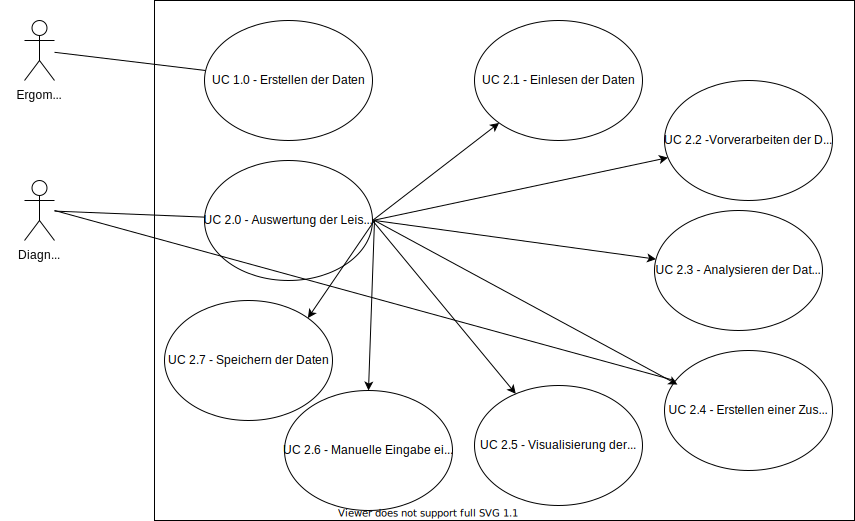

# Beschreibung der Anwendungsfälle

## UML-Diagramm

## Tabellen

### UC 2.0. - Auswertung der Leistungsdaten

|                                | Erklärung                                                                                                                                                                               | Beispiel                                                                                                                                         |
|--------------------------------|-----------------------------------------------------------------------------------------------------------------------------------------------------------------------------------------|--------------------------------------------------------------------------------------------------------------------------------------------------|
| Name und Identifikationsnummer | Anwendungsfälle haben einen Namen und werden nach Sachgruppen geordnet durchnummeriert                                                                                                  | UC 2.0. - Auswertung der Leistungsdaten                                                                                                                |
| Beschreibung                   | Hier erfolgt eine kurze Beschreibung, was im Anwendungsfall passiert.                                                                                                                   | Die Diagnostiker:in führt das Programm aus, welche alle neuen Daten zu Leistungstests einliest und nacheinander aufbereitet. Die Diagnostiker:in kann alle Tests bewerten und dann abspeichern   |
| Beteiligte Akteure             | Akteure sind beteiligte Personen oder Systeme außerhalb des beschriebenen Systems.                                                                                                      | Diagnostiker:in                                                                                                                    |
| Status                         | Der Status sagt aus, wie weit die Arbeit an dem Anwendungsfall gediehen ist                                                                                                             | In Arbeit                                                                                                                                        |
| Verwendete Anwendungsfälle     | Wenn der Anwendungsfall auf andere Anwendungsfälle zurückgreift, werden diese Fälle hier aufgezählt.                                                                                    | UC 2.1, UC 2.2, UC 2.3, UC 2.4, UC 2.6, UC 2.6                                                                                                          |
| Auslöser                       | Der fachliche Grund bzw. die Gründe dafür, dass dieser Anwendungsfall ausgeführt wird.                                                                                                  | Nachbereitung einer Leistungsdiagnose durch Diagnostiker:in                                                                                           |
| Vorbedingungen                 | Alle Bedingungen, die erfüllt sein müssen, damit dieser Anwendungsfall ausgeführt werden kann.                                                                                          | Daten sind vollständig vorhanden (UC 1.0)                                                                                                                                            |
| Invarianten                    | Alle Bedingungen, die innerhalb und durch den Anwendungsfall nicht verändert werden dürfen, also auch in einem Misserfolgs- oder Fehlerszenario immer noch gewährleistet werden müssen. | Die Daten werden trotz des Abbruches in einem seperaten Ordner abgespeichert.                                                                        |
| Nachbedingung/Ergebnis         | Der Zustand, der nach einem erfolgreichen Durchlauf des Anwendungsfalls erwartet wird.                                                                                                  |  Eingangsordner ist leer. Die Daten stehen der Diagnostiker:in zur Nachbearbeitung zur Verfügung.                                                                    |
| Standardablauf                 | Die Diagnostiker:in führt das Programm aus, welche alle neuen Daten zu Leistungstests einliest und nacheinander aufbereitet. Bestätigt, dass kein Abbruchkriterium vorliegt und die Daten werden gespeichert                                       | Alle Leistungsstufen werden nacheinander durchlaufen. Überprüfung, ob Widerstandswerte eingehalten. Daten werden gespeichert.                     |
| Alternative Ablaufschritte     | Dies sind Szenarien, die sich außerhalb des Standardablaufs auch bei der (versuchten) Zielerreichung des Anwendungsfalls ereignen können.                                               | Diagnostiker:in erkennt Abbruchgrund und gibt diesen ein. Eingabe wird dokumentiert und mit Daten gespeichert.                                                                         |
| Hinweise                       | Kurze Erklärungen zum besseren Verständnis, Hinweise zu Nebeneffekten, Mengengerüsten soweit erforderlich und alles andere, das nicht weiter oben dargestellt werden kann.              | keine                                                                                                                                            |
| Änderungsgeschichte            | Versionierung, Name des Autors, Datum                                                                                                                                                   | 0.01; 10.01.2022.; Julian Huber                                                                                                                  |
|                                |                                                                                                                                                                                         |                                                                                                                                                  |

### UC 2.6. - Manuelle Eingabe eines Abbruchkriteriums

|                                | Erklärung                                                                                                                                                                               | Beispiel                                                                                                                                         |
|--------------------------------|-----------------------------------------------------------------------------------------------------------------------------------------------------------------------------------------|--------------------------------------------------------------------------------------------------------------------------------------------------|
| Name und Identifikationsnummer | Anwendungsfälle haben einen Namen und werden nach Sachgruppen geordnet durchnummeriert                                                                                                  | UC 2.6. - Manuelle Eingabe eines Abbruch-Kriteriums                                                                                                                |
| Beschreibung                   | Hier erfolgt eine kurze Beschreibung, was im Anwendungsfall passiert.                                                                                                                   | Die Diagnostiker:in beobachtet und überwacht die Durchführung des Leistungtests. Der manuelle Abbruch des Tests erfolgt nach Erkennen der Diagnostiker:in bestimmter Abbruchkriterien. Dies wird mittels Kommandozeile ausgeführt.  |
| Beteiligte Akteure             | Akteure sind beteiligte Personen oder Systeme außerhalb des beschriebenen Systems.                                                                                                      | Diagnostiker:in, Proband:in                                                                                                                    |
| Status                         | Der Status sagt aus, wie weit die Arbeit an dem Anwendungsfall gediehen ist                                                                                                             | In Arbeit                                                                                                                                        |
| Verwendete Anwendungsfälle     | Wenn der Anwendungsfall auf andere Anwendungsfälle zurückgreift, werden diese Fälle hier aufgezählt.                                                                                    | keine      |
| Auslöser                       | Der fachliche Grund bzw. die Gründe dafür, dass dieser Anwendungsfall ausgeführt wird.                                                                                                  | Abbruch-Kriterien: Puls = 90% der maximalen Herzfrequenz(220-Lebensalter)|
| Vorbedingungen                 | Alle Bedingungen, die erfüllt sein müssen, damit dieser Anwendungsfall ausgeführt werden kann.                                                                                          | Daten werden aufgezeichnet und sind einsehbar (UC 1.0)                                                                                                                                            |
| Invarianten                    | Alle Bedingungen, die innerhalb und durch den Anwendungsfall nicht verändert werden dürfen, also auch in einem Misserfolgs- oder Fehlerszenario immer noch gewährleistet werden müssen. | Originial-Aufzeichnung bleiben vorhanden, bis verarbeitete Daten gespeichert werden                                                                        |
| Nachbedingung/Ergebnis         | Der Zustand, der nach einem erfolgreichen Durchlauf des Anwendungsfalls erwartet wird.                                                                                                  | Grafiken und Auswertungen sind gespeichert. Eingangsordner ist leer.                                                                    |
| Standardablauf                 | Die Diagnostiker:in führt das Programm aus, welche alle neuen Daten zu Leistungstests einliest und nacheinander aufbereitet. Bestätigt, dass kein Abbruchkriterium vorliegt und die Daten werden gespeichert                                       | 3minütiger Leistungstest wird durchlaufen, Die Diagnostiker:in erkennt ein Abbruchkriterium und beendet den Test. Der Abbruchgrund wird dokumentiert und mit den Daten gespeichert.         |
| Alternative Ablaufschritte     | Dies sind Szenarien, die sich außerhalb des Standardablaufs auch bei der (versuchten) Zielerreichung des Anwendungsfalls ereignen können.                                               | Diagnostiker:in erkennt Abbruchgrund und gibt diesen ein. Eingabe wird dokumentiert und mit Daten gespeichert.                                                                         |
| Hinweise                       | Kurze Erklärungen zum besseren Verständnis, Hinweise zu Nebeneffekten, Mengengerüsten soweit erforderlich und alles andere, das nicht weiter oben dargestellt werden kann.              | keine                                                                                                                                            |
| Änderungsgeschichte            | Versionierung, Name des Autors, Datum                                                                                                                                                   | 0.01; 19.03.2022.; Jennifer Ladig, David Mijulik, Fabienne Hilda Jordan                                                                                                                  |
|                                |                                                                                                                                                                                         |                                                                                                                                                  |

